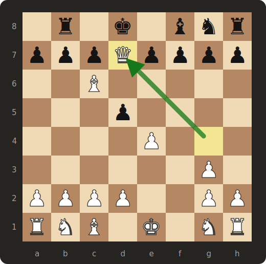

<div align="center">

# ♟️ Шахматный движок

**Минималистичный шахматный движок на C++ — с нуля, без зависимостей кроме STL.**

[](https://en.cppreference.com/w/cpp/17)
[](CMakeLists.txt)
[](https://github.com/ByteMe6/chess-engine/releases/latest)
[](src/chessEngine.hpp)
[](https://github.com/ByteMe6/chess-engine)
[](LICENSE)
[](CONTRIBUTING.md)

[English](README.md) · [Українська](README.uk.md) · **Русский**



*Финальная позиция встроенного демо — белый ферзь только что поставил мат на d7.*

</div>

---

## 📖 Содержание

- [Что это?](#-chto-eto)
- [Быстрый старт](#-bystryj-start)
- [Возможности](#-vozmozhnosti)
- [Использование](#-ispolzovanie)
- [Справочник API](#-spravochnik-api)
- [Как это работает](#-kak-eto-rabotaet)
- [Структура проекта](#-struktura-proekta)
- [Планы](#%EF%B8%8F-plany)
- [Вклад](#-vklad)
- [Лицензия](#-litsenziya)

<a id="-chto-eto"></a>
## ✨ Что это?

Небольшой и читаемый шахматный движок без единой библиотеки под капотом — каждое правило написано вручную поверх стандартной библиотеки C++. Он знает, как ходят фигуры, проверяет легальность ходов, понимает шахматную нотацию и рисует доску прямо в терминале.

Это в первую очередь учебный проект: код написан так, чтобы его было приятно читать. Если вам когда-нибудь было интересно, как шахматные программы генерируют ходы, — `src/chessEngine.hpp` отвечает на это за ~250 строк.

<a id="-bystryj-start"></a>
## 🚀 Быстрый старт

**Готовые бинарники** — берите на [странице релизов](https://github.com/ByteMe6/chess-engine/releases/latest): Linux (x86_64 / arm64), Windows (x86_64 / arm64), macOS (universal). В репозитории тоже лежит один — `bin/chess-engine` (macOS universal — Apple Silicon и Intel):

```bash
git clone git@github.com:ByteMe6/chess-engine.git
cd chess-engine
./bin/chess-engine
```

**Сборка из исходников** (любая платформа с CMake ≥ 3.16 и компилятором C++17):

```bash
cmake -B build
cmake --build build
./build/chess-engine
```

Демо разыгрывает короткую партию, которая заканчивается матом — смотри на последние строки:

```console
$ ./bin/chess-engine

  a b c d e f g h
8 r n b q k b n r 8
7 p p p p p p p p 7
6                 6
5                 5
4                 4
3                 3
2 P P P P P P P P 2
1 R N B Q K B N R 1
  a b c d e f g h

Pawn e2: [ [ 5, 4 ], [ 4, 4 ] ]
Game over: White won
The game is over

  a b c d e f g h
8   r   k   b n r 8
7 p p p Q p p p p 7
6     B           6
5       p         5
4         P       4
3             P   3
2 P P P P     P P 2
1 R N B   K   N R 1
  a b c d e f g h
```

Заглавные буквы — белые, строчные — чёрные. Олдскульный FEN-вайб.

<a id="-vozmozhnosti"></a>
## 🧠 Возможности

- ✅ **Генерация ходов для всех фигур** — король, ферзь, ладья, слон, конь, пешка
- ✅ **Правильные дальнобойные фигуры** — ферзь/ладья/слон идут по лучу, пока не упрутся; взятие завершает луч, своих бить нельзя
- ✅ **Полная логика пешки** — ход на одну клетку, на две с начальной горизонтали, взятие по диагонали только когда там действительно стоит враг
- ✅ **Шахматная нотация на вход и выход** — `makeMove("e2", "e4")` просто работает
- ✅ **Валидация ходов** — нелегальные ходы отклоняются
- ✅ **Очерёдность ходов** — `currColor` помнит, чей ход; ход не в свою очередь отклоняется
- ✅ **Шах, мат и пат** — ходы, оставляющие своего короля под шахом, нелегальны; партия заканчивается `Game over: White won` или `Game over: draw`
- ✅ **Рокировка и взятие на проходе** — по полным правилам: права отслеживаются и теряются после хода короля или ладьи, окно e.p. живёт ровно один ход
- ✅ **Импорт/экспорт FEN** — стартуйте с любой позиции через `loadFen()` или `Board(fen)`, выгружайте текущую через `toFen()`; права на рокировку и клетка e.p. — настоящие поля FEN
- ✅ **ASCII-отрисовка доски** — с координатами
- ✅ **Чистый современный C++17** — фигуры как `enum class`, structured bindings, исчерпывающий `switch` с защитным `throw`, только STL

| Фигура | Буква | Как ходит |
|:------:|:-----:|-----------|
| ♔ Король | `K` | на одну клетку в любом направлении |
| ♕ Ферзь | `Q` | на любое расстояние по вертикали, горизонтали или диагонали |
| ♖ Ладья | `R` | на любое расстояние по вертикали или горизонтали |
| ♗ Слон | `B` | на любое расстояние по диагонали |
| ♘ Конь | `N` | буквой «Г» — единственная фигура, перепрыгивающая через другие |
| ♙ Пешка | `P` | на одну вперёд (на две с начальной горизонтали), бьёт по диагонали |

<a id="-ispolzovanie"></a>
## 🎮 Использование

```cpp
#include "src/chessEngine.hpp"

// настройка доски — полная начальная позиция в src/main.cpp

board.printBoard();               // вывести доску в консоль

board.makeMove("e2", "e4");       // ходы — обычная шахматная нотация
board.makeMove("e7", "e5");
board.makeMove("g1", "f3");       // нелегальные ходы просто отклоняются

Piece knight = board.board[5][5];         // конь, только что вставший на f3
board.getPossibleMoves(knight);           // -> e5 (взятие!), g5, d4, h4, g1

// или стартуем с любой позиции
Board endgame("6k1/5ppp/8/8/8/8/8/R3K3 w - - 0 1");
endgame.makeMove("a1", "a8");             // мат по последней горизонтали -> "Game over: White won"
```

<a id="-spravochnik-api"></a>
## 📚 Справочник API

| Метод | Сигнатура | Что делает |
|-------|-----------|------------|
| `makeMove` | `void makeMove(const std::string& from, const std::string& to)` | Выполняет ход в шахматной нотации; сначала проверяет его легальность |
| `getPossibleMoves` | `std::vector<std::array<int, 2>> getPossibleMoves(const Piece& piece)` | Все клетки, куда фигура может легально пойти |
| `printBoard` | `void printBoard()` | Рисует позицию в ASCII с координатами |
| `translateCoords` | `std::array<int, 2> translateCoords(const std::string& square)` | `"e2"` → `{6, 4}`; бросает исключение на некорректной клетке |
| `translateToNotation` | `std::string translateToNotation(std::array<int, 2> coords)` | `{6, 4}` → `"e2"` |
| `isInsideBoard` | `bool isInsideBoard(int row, int col)` | Проверка границ доски 8×8 |
| `isInCheck` | `bool isInCheck(PieceColor side)` | Под боем ли король этой стороны прямо сейчас |
| `isMate` | `bool isMate(PieceColor side)` | Мат: шах и ни одного легального хода |
| `isStalemate` | `bool isStalemate(PieceColor side)` | Пат: шаха нет, но и легальных ходов нет |
| `loadFen` | `void loadFen(const std::string& fen)` | Загружает позицию из FEN (есть и конструктор `Board(fen)`) |
| `toFen` | `std::string toFen()` | Текущая позиция в формате FEN |

<a id="-kak-eto-rabotaet"></a>
## 🔍 Как это работает

**Представление доски.** Доска — обычный `std::vector` 8×8 из объектов `Piece`. Строка 0 — это 8-я горизонталь (тыл чёрных), строка 7 — 1-я горизонталь (тыл белых):

```
board[row][col]
                 col:  0  1  2  3  4  5  6  7
                       a  b  c  d  e  f  g  h
row 0  →  8-я горизонталь   ┌─ тыл чёрных
row 7  →  1-я горизонталь   └─ тыл белых

"e2"  →  board[6][4]
```

**Генерация ходов.** У каждого типа фигуры свой case в одном `switch`. Ферзь, ладья и слон используют общий `addSlidingMoves()`: движок шагает в каждом направлении — пустая клетка продолжает луч, вражеская фигура берётся и завершает его, своя фигура блокирует. Кони и короли проверяют фиксированный набор смещений; у пешек свои правила для ходов и взятий.

**Валидация.** `makeMove` переводит нотацию, находит фигуру и выполняет ход только если целевая клетка есть в `getPossibleMoves` — иначе ничего не происходит.

**Типобезопасность.** Фигуры — это `enum class`, поэтому содержимое клетки не спутать с обычным символом, а `switch` по фигурам завершается защитным `throw` для недостижимого случая.

<a id="-struktura-proekta"></a>
## 📁 Структура проекта

```
├── src/
│   ├── chessEngine.hpp   # Board, Piece, генерация ходов — мозг проекта
│   └── main.cpp          # Демо: короткая партия до мата
├── bin/
│   └── chess-engine      # собранный бинарник (macOS universal)
├── assets/
│   └── board.svg         # диаграмма доски выше
└── CMakeLists.txt
```

<a id="-plany"></a>
## 🗺️ Планы

- [x] Контроль очерёдности ходов
- [x] Шах и мат
- [x] Пат
- [x] Рокировка
- [x] Взятие на проходе
- [ ] Превращение пешки
- [ ] Правила ничьей (повторение, 50 ходов)
- [x] Импорт/экспорт FEN
- [ ] Тесты

<a id="-vklad"></a>
## 🤝 Вклад

Issues и pull requests приветствуются — в [планах](#%EF%B8%8F-plany) полно хорошо очерченных идей. Правила на две минуты чтения — в [CONTRIBUTING.md](CONTRIBUTING.md).

```bash
cmake -B build            # настройка
cmake --build build       # компиляция (должна оставаться без предупреждений)
./build/chess-engine      # запустить демо
```

<a id="-litsenziya"></a>
## 📜 Лицензия

[GPL-3.0](LICENSE) — свободная, как и положено.

---

<div align="center">

*Сделано с ♟️ и C++. Если этот репозиторий вас чему-то научил — ⭐ порадует пешек.*

</div>
